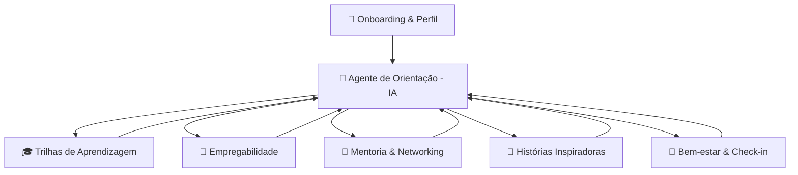
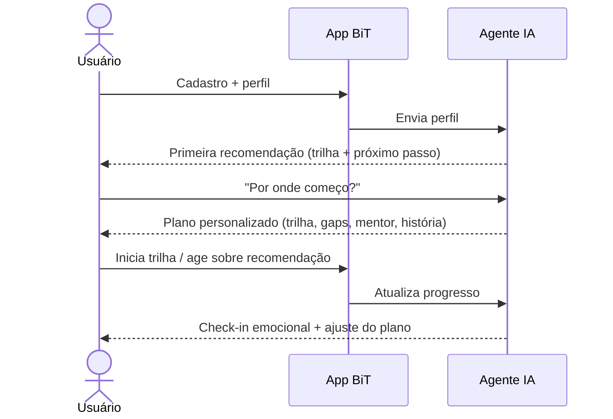

# 02 — Especificação Funcional

Este documento descreve **o que o App BiT faz**: módulos, funcionalidades, histórias de usuário (user stories), a jornada principal e os requisitos não-funcionais.

---

## 🧩 Visão dos módulos

O **Agente de Orientação (IA)** é o núcleo: ele lê o perfil, conversa com o usuário e aciona os demais módulos, costurando tudo em uma jornada coerente.

---

## 1. 👤 Onboarding & Perfil

**Descrição:** primeira experiência do usuário. Coleta dados essenciais para personalizar a jornada, de forma leve e inclusiva.

**Funcionalidades**
- Cadastro e autenticação.
- Questionário de perfil: objetivo (1º emprego, transição, recolocação, crescimento), área de interesse, nível atual, escolaridade, disponibilidade de tempo.
- Captura de contexto: **localização** e **qualidade de conectividade** (para adaptar recomendações).
- Autoavaliação de habilidades (técnicas e comportamentais).
- Consentimento explícito de uso de dados (LGPD), com destaque para dados emocionais.

**User stories**
- Como usuário novo, quero responder poucas perguntas e já receber uma primeira recomendação, para sentir valor imediato.
- Como usuário, quero poder pular perguntas opcionais, para não me sentir bloqueado.

---

## 2. 🤖 Agente de Orientação (IA) — núcleo

**Descrição:** assistente conversacional que orienta o usuário de ponta a ponta. Entende o perfil, responde dúvidas e recomenda os próximos passos acionando os outros módulos.

**Funcionalidades**
- Conversa em linguagem natural (chat).
- Recomendação personalizada de trilhas, ações de empregabilidade, mentores e histórias.
- Explicação do **porquê** de cada recomendação (transparência).
- Memória de contexto: lembra objetivos, progresso e preferências entre sessões.
- Próximo passo sempre acionável ("comece esta trilha", "atualize seu currículo", "fale com este mentor").

**User stories**
- Como usuário, quero perguntar "por onde começo?" e receber um plano claro, para não me sentir perdido.
- Como usuário, quero que o app lembre do que já fiz, para não recomeçar do zero toda vez.
- Como usuário, quero entender por que algo foi recomendado, para confiar na sugestão.

> Como o agente funciona tecnicamente (modelos, ferramentas, RAG) está em [03 — Arquitetura Técnica](03-arquitetura-tecnica.md#camada-de-ia).

---

## 3. 🎓 Trilhas de Aprendizagem

**Descrição:** caminhos de estudo personalizados, organizados em etapas, adequados ao objetivo e ao nível do usuário.

**Funcionalidades**
- Recomendação de trilhas com base no perfil e nos gaps identificados.
- Trilha em etapas com progresso visível.
- Curadoria de conteúdos (internos e/ou externos), com filtro por **baixo consumo de dados** quando a conectividade é limitada.
- Marcar etapa como concluída; retomar de onde parou.

**User stories**
- Como usuário, quero uma trilha passo a passo, para saber exatamente o que estudar agora.
- Como usuário com internet limitada, quero priorizar conteúdos leves, para conseguir estudar mesmo offline/com pouca banda.

---

## 4. 💼 Empregabilidade

**Descrição:** ajuda o usuário a se tornar empregável e a encontrar oportunidades, identificando lacunas e sugerindo ações.

**Funcionalidades**
- Análise de **gaps** entre o perfil atual e as vagas/objetivos desejados.
- Sugestões concretas: habilidades a desenvolver, melhorias de currículo, projetos de portfólio.
- Recomendação de vagas compatíveis (com filtro por remoto/local conforme localização).
- Preparação para entrevistas (dicas, perguntas comuns, simulação com a IA).

**User stories**
- Como usuário, quero saber o que falta para a vaga dos meus sonhos, para focar meu esforço.
- Como usuário, quero ver vagas compatíveis com meu nível, para não me frustrar com requisitos impossíveis.

---

## 5. 🤝 Mentoria & Networking

**Descrição:** conecta usuários a mentores e a uma rede de apoio.

**Funcionalidades**
- Recomendação de mentores por afinidade (área, trajetória, identidade).
- Agendamento de sessões de mentoria.
- Espaços de networking (comunidades/grupos por interesse).
- Histórico de conexões e sessões.

**User stories**
- Como usuário, quero encontrar um mentor com uma trajetória parecida com a minha, para me sentir representado.
- Como mentor, quero ver o perfil e o objetivo do mentorado antes da sessão, para ajudar melhor.

---

## 6. 🌟 Histórias Inspiradoras

**Descrição:** biblioteca de histórias reais de profissionais que superaram barreiras semelhantes.

**Funcionalidades**
- Feed de histórias personalizado por afinidade com o perfil.
- Filtro por área, tipo de desafio superado e identidade.
- Possibilidade de salvar/favoritar histórias.

**User stories**
- Como usuário inseguro, quero ler histórias de quem passou pelo que eu passo, para me motivar.

---

## 7. 🧠 Bem-estar & Check-in emocional

**Descrição:** acompanha o estado emocional do usuário e sugere ações de bem-estar — reconhecendo que barreiras geram impacto emocional.

**Funcionalidades**
- Check-in emocional periódico (rápido e opcional).
- Recomendações de ações de bem-estar conforme o estado relatado.
- Acompanhamento de evolução emocional ao longo do tempo.
- **Guardrails de segurança:** detecção de sinais de risco e **encaminhamento para apoio humano/profissional**.

> ⚠️ **Segurança em saúde mental (requisito obrigatório):** o App BiT **não substitui** atendimento psicológico. Diante de sinais de sofrimento agudo ou risco, o app deve exibir, de forma clara e imediata, canais de apoio — no Brasil, o **CVV (Centro de Valorização da Vida), telefone 188**, e serviços de emergência. A IA não diagnostica nem trata; ela acolhe, orienta e encaminha.

**User stories**
- Como usuário, quero registrar como estou me sentindo em segundos, para que o app entenda meu momento.
- Como usuário em um dia difícil, quero receber acolhimento e, se necessário, ser direcionado a ajuda real.

---

## 🧭 Jornada principal do usuário

---

## ⚙️ Requisitos não-funcionais

| Categoria | Requisito |
|-----------|-----------|
| ♿ **Acessibilidade** | Conformidade com WCAG 2.1 AA; navegação por teclado; bom contraste; textos alternativos. |
| 📶 **Conectividade** | Funcionar bem em redes lentas; modo de baixo consumo de dados; degradação graciosa. |
| 📍 **Localização** | Adaptar oportunidades (remoto/local) e conteúdos conforme a região. |
| 🔐 **Privacidade (LGPD)** | Consentimento explícito; dados emocionais tratados como sensíveis; direito de exclusão. |
| 🛡️ **Segurança** | Autenticação segura; criptografia em trânsito e em repouso; controle de acesso. |
| ⚡ **Performance** | Respostas da IA com streaming (feedback imediato); tempos de carregamento baixos. |
| 🌍 **Internacionalização** | Arquitetura preparada para múltiplos idiomas e regiões (pós-MVP). |
| 📈 **Escalabilidade** | Suportar crescimento de usuários sem reescrita (ver [03](03-arquitetura-tecnica.md)). |

> O recorte do que entra no **MVP** está em [06 — Roadmap & MVP](06-roadmap-mvp.md).
