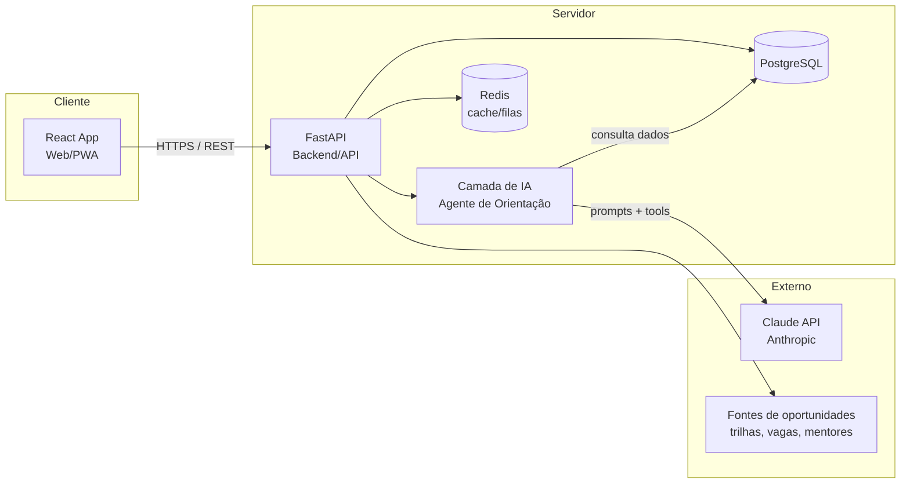
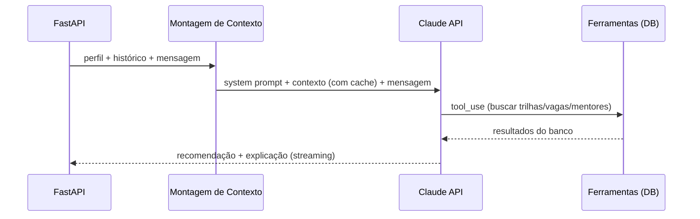

# 03 — Arquitetura Técnica

Este documento descreve **como o App BiT é construído**: stack, camadas, a inteligência por trás do agente, segurança e escalabilidade.

---

## 🏛️ Visão geral

A IA é uma **camada do backend**, não um serviço separado no MVP — o FastAPI orquestra a conversa, busca dados no banco e chama a API da Claude.

---

## 🧱 Stack e justificativas

| Camada | Tecnologia | Por quê |
|--------|-----------|---------|
| **Frontend** | React (Web / PWA) | Ecossistema maduro; PWA permite experiência "de app" com baixo custo e bom suporte a conectividade limitada (cache offline). |
| **Backend / API** | Python + FastAPI | Produtivo, assíncrono (ideal para chamadas de IA com streaming), tipado (Pydantic) e com a melhor afinidade com o ecossistema de IA. |
| **IA** | Claude (Anthropic) via SDK Python | Modelos fortes em raciocínio e conversa; suporte nativo a _tool use_, _streaming_ e _prompt caching_. |
| **Banco de dados** | PostgreSQL | Relacional robusto; suporta dados estruturados (perfil, trilhas, vagas) e `JSONB` para flexibilidade. |
| **Cache / filas** | Redis _(opcional no MVP)_ | Cache de sessão e processamento assíncrono (ex.: recomendações em lote). |
| **Auth** | JWT (OAuth2 password/bearer do FastAPI) | Padrão simples e seguro para o MVP. |

---

## 🧠 Camada de IA

O **Agente de Orientação** é o coração do produto. Ele combina o perfil do usuário, o histórico e os dados da plataforma para gerar recomendações e conversar.

### Como funciona (fluxo)

### Padrões adotados

- **Tool use (function calling):** o agente não "inventa" trilhas/vagas — ele chama ferramentas (`buscar_trilhas`, `buscar_vagas`, `buscar_mentores`, `analisar_gaps`) que consultam o banco. Isso mantém as respostas **factuais e ancoradas nos dados reais** da plataforma.
- **Adaptive thinking:** habilitado para tarefas de raciocínio (montar planos, analisar gaps), deixando o modelo decidir quando pensar mais.
- **Prompt caching:** o _system prompt_ (instruções do agente) e o contexto estável do usuário são cacheados, reduzindo custo e latência em conversas multi-turno.
- **Streaming:** respostas transmitidas em tempo real para feedback imediato na UI.
- **Structured outputs:** quando a saída precisa ser consumida por código (ex.: lista de recomendações), usa-se saída estruturada (JSON Schema) em vez de texto livre.

### Modelos Claude — quando usar cada um

| Tarefa | Modelo sugerido | Motivo |
|--------|-----------------|--------|
| Agente de orientação / raciocínio sobre o plano | `claude-opus-4-8` (máxima qualidade) ou `claude-sonnet-4-6` (melhor custo/benefício) | Raciocínio complexo, multi-turno, com ferramentas. |
| Conversa de alto volume / produção | `claude-sonnet-4-6` | Bom equilíbrio entre inteligência, velocidade e custo. |
| Check-in emocional rápido / classificação | `claude-haiku-4-5` | Rápido e econômico para tarefas simples e sensíveis a latência. |

> Custos de referência (por 1M de tokens, entrada/saída): Opus 4.8 `$5 / $25` · Sonnet 4.6 `$3 / $15` · Haiku 4.5 `$1 / $5`. Recomendação para o MVP: **Sonnet 4.6** como padrão do agente e **Haiku 4.5** nos check-ins. _Valores sujeitos a atualização — confirmar na documentação oficial da Anthropic._

### Guardrails de saúde mental

O módulo de bem-estar exige cuidado especial:
- Instruções no _system prompt_ para **acolher, não diagnosticar**.
- Detecção de sinais de risco → exibição imediata de canais de apoio (**CVV 188** no Brasil) e recomendação de ajuda profissional.
- A IA nunca substitui atendimento humano/profissional (ver [02 — Bem-estar](02-especificacao-funcional.md#7--bem-estar--check-in-emocional)).

---

## 🔐 Segurança e privacidade

- **Transporte:** HTTPS/TLS em todas as comunicações.
- **Dados em repouso:** criptografia no banco; segredos (API keys) em variáveis de ambiente / secrets manager — **nunca no código**.
- **Autenticação/autorização:** JWT; controle de acesso por papel (usuário, mentor, admin).
- **LGPD:** consentimento explícito; dados emocionais tratados como **sensíveis**; direito à exclusão; minimização de dados.
- **IA:** dados sensíveis não são embutidos em prompts persistentes/cacheados de forma indevida; logs de conversa protegidos.

---

## 🚀 Infraestrutura e deploy

- **Ambientes:** desenvolvimento, staging, produção.
- **Containerização:** Docker para padronizar backend e dependências.
- **CI/CD:** pipeline de testes + deploy automatizado (ex.: GitHub Actions).
- **Hospedagem:** serviço gerenciado de contêineres + banco gerenciado (a definir conforme orçamento).
- **Observabilidade:** logs estruturados, métricas de uso da IA (tokens, latência, custo) e monitoramento de erros.

---

## 📈 Escalabilidade

- **Backend stateless** (sessão via JWT) → escala horizontalmente.
- **Banco:** réplicas de leitura e índices conforme o crescimento.
- **IA:** uso de _prompt caching_ e do modelo certo por tarefa para controlar custo; processamento assíncrono (Redis/filas) para recomendações em lote.
- **Internacionalização:** camada de conteúdo preparada para múltiplos idiomas/regiões.

> O detalhamento das entidades do banco está em [04 — Modelo de Dados](04-modelo-de-dados.md). Os contratos da API estão em [05 — API](05-api.md).
