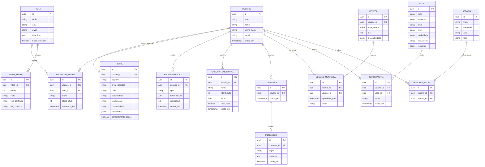

# 04 — Modelo de Dados

Modelo de dados **conceitual** do App BiT. Serve de base para a modelagem física no PostgreSQL — nomes e tipos finais podem ser ajustados na implementação.

---

## 🗺️ Diagrama de entidades (ER)

---

## 📋 Principais entidades

### USUARIO
Conta na plataforma. `papel` ∈ `{ usuario, mentor, admin }`.

| Campo | Tipo | Notas |
|-------|------|-------|
| id | UUID (PK) | |
| email | string | único |
| nome | string | |
| senha_hash | string | nunca armazenar senha em texto puro |
| papel | enum | `usuario` / `mentor` / `admin` |
| criado_em | timestamp | |

### PERFIL
Dados que personalizam a jornada (relação 1:1 com USUARIO).

| Campo | Tipo | Notas |
|-------|------|-------|
| objetivo | enum | `primeiro_emprego` / `transicao` / `recolocacao` / `crescimento` |
| area_interesse | string | ex.: front-end, dados, QA |
| nivel | enum | `iniciante` / `intermediario` / `avancado` |
| localizacao | string | para adaptar oportunidades |
| conectividade | enum | `boa` / `limitada` — ativa modo de baixo consumo |
| habilidades | JSONB | autoavaliação (técnicas e comportamentais) |
| consentimento_dados | boolean | LGPD — obrigatório |

### TRILHA / ETAPA_TRILHA / INSCRICAO_TRILHA
Trilha é o caminho de estudo; ETAPA são seus passos ordenados; INSCRICAO liga o usuário à trilha e guarda o progresso (`etapa_atual`, `status` ∈ `{em_andamento, concluida, abandonada}`). `baixo_consumo` marca conteúdos leves para conectividade limitada.

### VAGA / CANDIDATURA
Oportunidades de emprego e o vínculo do usuário a elas. `modalidade` ∈ `{remoto, presencial, hibrido}`; `requisitos` em JSONB alimenta a análise de gaps.

### MENTOR / SESSAO_MENTORIA
Perfil de mentor (estende USUARIO) e agendamento de sessões. `status` ∈ `{agendada, realizada, cancelada}`.

### HISTORIA / HISTORIA_SALVA
Biblioteca de histórias inspiradoras e os favoritos do usuário.

### CHECKIN_EMOCIONAL
Registro do estado emocional. `sinal_risco` é um booleano calculado para disparar os guardrails de segurança (ver [03](03-arquitetura-tecnica.md#guardrails-de-saúde-mental)).

> ⚠️ Tabela com **dado sensível (LGPD)** — acesso restrito, criptografia e política de retenção específicas.

### RECOMENDACAO
Recomendações geradas pela IA. `tipo` ∈ `{trilha, vaga, mentor, historia, acao}`; `referencia_id` aponta para o item; `justificativa` guarda o "porquê" exibido ao usuário.

### CONVERSA / MENSAGEM
Histórico do chat com o agente. `papel` da mensagem ∈ `{usuario, assistente, sistema}`.

> Os endpoints que manipulam essas entidades estão em [05 — API](05-api.md).
