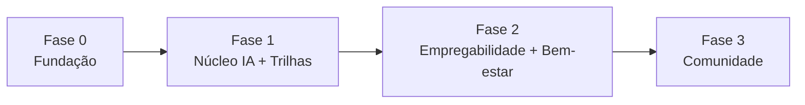

# 06 — Roadmap & MVP

Este documento define **o recorte de entrega**: o que compõe o MVP, o que fica para depois, as fases e os critérios de aceitação.

---

## 🎯 Objetivo do MVP

Validar a hipótese central do App BiT:

> Uma pessoa de grupo sub-representado, ao receber **orientação personalizada por IA** com um **próximo passo claro**, avança de fato na sua jornada — e se sente acolhida no processo.

O MVP deve provar isso com o **menor escopo funcional possível**, mas ponta a ponta.

---

## ✅ Escopo do MVP

| Módulo | Entra no MVP? | Recorte |
|--------|:---:|---------|
| 👤 Onboarding & Perfil | ✅ | Cadastro, login e questionário essencial de perfil. |
| 🤖 Agente de Orientação (IA) | ✅ | Chat que lê o perfil e recomenda **trilha + próximo passo**, com explicação. |
| 🎓 Trilhas de Aprendizagem | ✅ | Recomendação + visualização da trilha em etapas + progresso. |
| 💼 Empregabilidade | ⚠️ Parcial | Análise de gaps simples; listagem de vagas (sem candidatura completa). |
| 🧠 Bem-estar & Check-in | ⚠️ Parcial | Check-in emocional básico + **guardrails de segurança e canais de apoio** (obrigatórios). |
| 🤝 Mentoria & Networking | ❌ | Fora do MVP (apenas modelado). |
| 🌟 Histórias Inspiradoras | ❌ | Fora do MVP (apenas modelado). |

> Os guardrails de saúde mental (exibição do **CVV 188** e encaminhamento) são **obrigatórios mesmo no MVP** sempre que o módulo de bem-estar estiver ativo — é requisito ético, não opcional.

---

## 🚫 Fora do escopo do MVP (pós-MVP)

- Mentoria, networking e histórias inspiradoras (completos).
- Candidatura completa a vagas e integração com sistemas externos de vagas.
- Internacionalização (múltiplos idiomas/regiões).
- App nativo (o MVP é Web/PWA).
- Modo offline avançado.

---

## 🗺️ Fases de entrega

### Fase 0 — Fundação
- Setup do repositório, ambientes e CI/CD.
- Estrutura base do FastAPI + React.
- Modelo de dados inicial e autenticação (JWT).

### Fase 1 — Núcleo de IA + Trilhas _(coração do MVP)_
- Onboarding e perfil.
- Integração com a Claude API (agente com _tool use_ + streaming).
- Recomendação de trilhas e acompanhamento de progresso.

### Fase 2 — Empregabilidade + Bem-estar
- Análise de gaps e listagem de vagas.
- Check-in emocional + guardrails de segurança.

### Fase 3 — Comunidade _(pós-MVP)_
- Mentoria, networking e histórias inspiradoras.

---

## 📐 Critérios de aceitação do MVP

O MVP está pronto quando um usuário consegue, de ponta a ponta:

- [ ] Criar conta e preencher o perfil em poucos minutos.
- [ ] Conversar com o agente e perguntar "por onde começo?".
- [ ] Receber uma **trilha recomendada com justificativa** e um **próximo passo claro**.
- [ ] Iniciar a trilha e ter seu **progresso salvo** entre sessões.
- [ ] Ver uma **análise de gaps** básica em relação a um objetivo.
- [ ] Fazer um **check-in emocional** e, em caso de sinal de risco, ver **imediatamente** os canais de apoio.
- [ ] Usar tudo isso em uma experiência **acessível** e que **funcione em conexões lentas**.

---

## 📊 Como medir o sucesso do MVP

Acompanhar os KPIs definidos em [01 — Objetivos e métricas](01-visao-geral.md#-objetivos-e-métricas-de-sucesso-kpis), com foco inicial em:

1. **% de usuários que recebem e iniciam uma trilha recomendada.**
2. **% que completa ≥ 1 ação sugerida pela IA.**
3. **Qualidade percebida das recomendações** (avaliação simples 👍/👎 por recomendação).

> Próximo passo após o MVP: usar os dados reais para recalibrar metas e priorizar a Fase 3.
